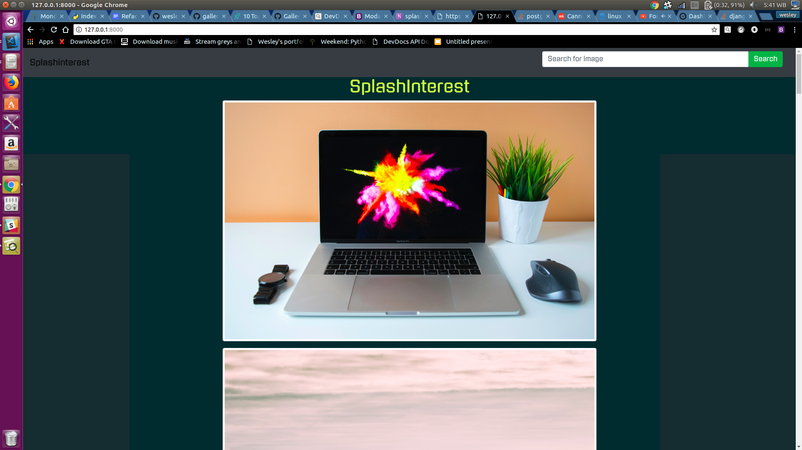

# Splashinterest

This is a simple application that is a mashup of two of the greatest and free sites for getting images. Splashinterest provides all of the features of the sites mentioned and just a bit more. 

## By **Wesley Mutwiri**

## Live Demo
    
Coming soon

## Description

Splashinterest is a simple application made using python-django framework which displays images to users. The users can also search images on the site. Image links can be copied for downloading and also image description and locations can be found from the site. The images are divided into categories and each and every image has information that may be valuable to the viewers of the site. Get high quality images for free right from this site. The images are added via the admin and viewers can only view and copy image links. Uploading of images is purely the administrators work which easens the work of the user. The site doesn't require logging in. Enjoy the content.  

### Setup and Installation Requirements

1. Open your default web browser  
2. Internet connection is required  
3. Search For wesleymutwiri on github and click on the repository gallery2.  
4. No other downloads or plug-ins are required to view this python application  
5. Click on the live site link on the github repository 
6. Give feedback through the contacts found below and report any bugs experienced  
7. Alternatively, use the livelink found down below

## Known bugs

There are currently no known bugs experienced on the website but feedback on bugs experienced during use of the website will be highly appreciated. The only reason that the website may fail to load is if the Internet connection is slow or disconnected which will require you to troubleshoot your Internet connection. Thankyou in advance for your support.

## Technologies used

* HTML5
* CSS
* Bootstrap4
* Python3.6
* django
* Heroku
* Git
## Support and contact details

Contact me on my github account
<https://github.com/wesleymutwiri>

copyright (c) {2018} {Wesley Mutwiri}